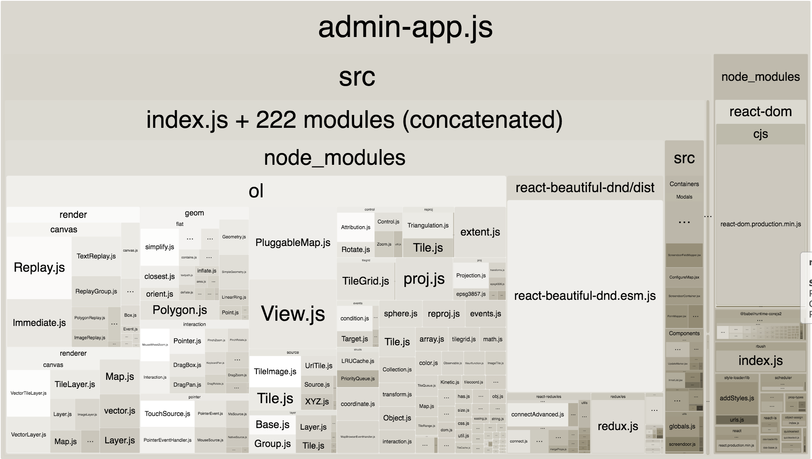

# Scripts

The following scripts can be used to aid in development for this plugin:

- [Build](#Build) - Compile JavaScript and CSS files.
- [Dev](#Dev) - Run development compilation/server.
- [Profile](#Profile) - View JavaScript bundle analysis.
- [Setup](#Setup) - Install plugin dependencies.
- [Version](#Version) - Update the plugin version number.

## Build

The `build` script compiles the plugin's JavaScript and CSS bundles. There are three versions of this script - general, admin, and frontend.

The general version will compile the JS and CSS in both the admin directory and the public directory. To execute this script, run `npm run build` from the plugin's root directory.

The admin version will only compile the bundles for the administrative panel. To execute this script run `npm run build:admin` from the plugin's root directory. Alternately, you can run `npm run build` from the `admin/js` directory.

The frontend version will only compile the bundles for the event post type frontend. To execute this script run `npm run build:front` from the plugin's root directory. Alternately, you can run `npm run build` from the `public/js` directory.

## Dev

The `dev` script will run a development server to test the application. It can be run from either the `admin/js` or `public/js` directories to serve those particular bundles.

## Profile

Each time you run an admin or frontend build, Webpack will automatically generate a stats.json file for that bundle. This file provides useful information about the JavaScript bundle and included dependencies, but is not very human-readable.

Running the command `npm run profile` from either the `admin/js` or `public/js` directory will launch a [Webpack Bundle Analyzer](https://github.com/webpack-contrib/webpack-bundle-analyzer) visualization in localhost:8888 for the respective bundle. The result should look something like:

## Setup

The `setup` script installs the plugin's dependencies. There are three versions of this script - general, admin, and frontend.

The general version will run an NPM install in the plugin root, the plugin admin directory, and the public directory. To execute this script, run `npm run setup` from the plugin's root directory.

The admin version will run an NPM install in the `admin/js` directory of the plugin. To execute this script run `npm run setup:admin` from the plugin's root directory.

The frontend version will run an NPM install in the `public/js` directory of the plugin. To execute this script run `npm run setup:front` from the plugin's root directory.

## Version

The `version` script will update the version number for the plugin in five places: the plugin registration header in `iip-map.php`, the iip-events class constructor in `includes/class-iip-map.php`, and in each of the plugin's three package.json files (general, admin, and public).

This plugin follows [sematic versioning](https://semver.org/) wherein a major version includes incompatible plugin changes, a minor version adds functionality in a backwards-compatible manner, and a patch version makes backwards-compatible bug fixes. In keeping with this, the command accepts three arguments: `major`, `minor`, and `patch`.

The script will identify the current version based of the git tag and increment the appropriate version number by 1. For examples, assuming a starting version of v1.0.0:

- `npm run version major` will return v2.0.0
- `npm run version minor` will return v1.1.0
- `npm run version patch` will return v1.0.1

**Note:** This script will fail to run if you have uncommited changes on your git branch.